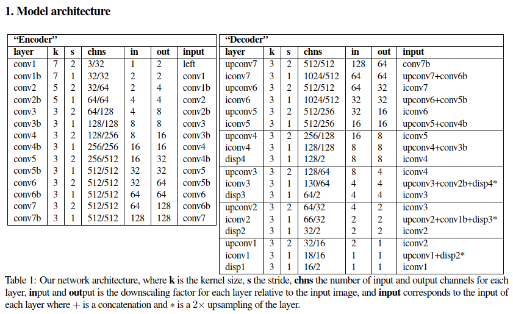

# MonoDepth

本实验设计基于[MonoDepth-PyTorch](https://github.com/OniroAI/MonoDepth-PyTorch/)，整理MonoDepth与resnet18, resnet50, Unet网络结构融合，便于训练的轻量简化。

论文Unsupervised Monocular Depth Estimation with Left-Right Consistency的相关文件如下：

1. [Original repo](https://github.com/mrharicot/monodepth)
2. [Original paper](https://arxiv.org/abs/1609.03677)

### 实验环境

本实验基于Python 3.6.9, Ubuntu 18.04 LTS, torch1.12.1环境测试，在阿里云<8核(vCPU) 31 GiB + NVIDIA T4>平台训练。

### 预装库

本实验使用了python3和virtualenv，可使用下述命令安装requirements.txt中指定的依赖：

```shell
virtualenv -p python3 .env
source .env/bin/activate
pip install -r requirements.txt
```

退出虚拟环境可使用`deactivate`。

### KITTI

本实验使用[KITTI](https://www.cvlibs.net/datasets/kitti/)数据集，主要使用其`/raw_data`文件夹中的`/image_02`与`/image_03`，前者为左视图，后者为右视图。
数据集可以使用下列命令获得。

```shell
wget -i kitti_archives_to_download.txt -P ~/my/output/folder/
```

[kitti_archives_to_download.txt](https://github.com/Wr0ne/monodepth_pytorch/blob/main/kitti_archives_to_download.txt)可在仓库内找到。

### Dataloader

Dataloader脚本假定了如示例的文件结构，`/data`文件夹包含了训练集`/train`，模型文件夹`/models`，验证集`/vals`，测试集`/test`...

```shell
data
├── train
│   ├── 2011_09_26_drive_0001_sync
│   │   ├── image_02
│   │   │   ├─ data
│   │   │   │   ├── 0000000000.png
│   │   │   │   └── ...
│   │   ├── image_03
│   │   │   ├── data
│   │   │   │   ├── 0000000000.png
│   │   │   │   └── ...
│   ├── ...
├── models
├── vals
├── output
├── test
│   ├── 2011_09_26_drive_0002_sync
│   │   ├── image_02
│   │   └── ...
│   ├── ...
```

### 模型训练以及检测

在示例文件`Monodepth.ipynb`中给出了训练模型，测试模型以及整理结果的代码。

本实验使用了KITTI数据集中的部分文件(~41.22G)进行训练模型与测试，如下：

```shell
2011_09_26_drive_0002_sync  0.30G
2011_09_26_drive_0014_sync  1.17G
2011_09_26_drive_0020_sync  0.35G
2011_09_26_drive_0035_sync  0.48G
2011_09_26_drive_0056_sync  1.13G
2011_09_26_drive_0079_sync  0.41G
2011_09_26_drive_0084_sync  1.47G
2011_09_26_drive_0101_sync  3.37G
2011_09_26_drive_0117_sync  2.59G
2011_09_29_drive_0071_sync  4.03G
2011_09_30_drive_0020_sync  4.47G
2011_09_30_drive_0033_sync  6.56G
2011_10_03_drive_0027_sync  14.89G
```

在训练结束后，在`2011_09_26_drive_0014_sync`数据上绘制gif结果。

## 摘要

基于深度学习的方法在单图像深度估计任务中展示出了优异的表现。但一般而言，大多模型都是基于语义来估计深度，或者根据显式深度数据来训练模型，本实验复现了一种用更容易获得的双目立体镜头数据学习单图像估计深度的模型--MonoDepth，该模型应用了较为特别的损失函数，以保证左右图像产生视差的一致性。MonoDepth用一边视图去产生另一边的视图，最终根据实际单目数据与模型推理得到数据的视差对深度进行估计。

## 实验说明

### 代码文件

#### utils.py

此脚本中主要是数据的准备工作，其中包含三个函数：

+ to_device() 将数据放进GPU
+ get_model() 创建模型
+ prepare_dataloader() 准备数据集的训练，调用transforms() 对图像进行变换

#### transforms.py

用于图片的数据增强，包含类ResizeImage，类ToTensor，类AugmentImagePair。

+ 类ResizeImage 将图片resize为合适的大小
+ 类ToTensor 将图片转换为Tensor格式存储
+ 类AugmentImagePair 随机伽马变换，随机亮度变换，随机色彩变换

#### loss.py

定义了模型损失函数的对应代码，包含三部分：重建损失，平滑损失，一致性损失。

对应论文中公式：

$$
C_s = \alpha_{ap} (C_{ap}^{l} + C_{ap}^{r}) + \alpha_{ds} (C_{ds}^{l} + C_{ds}^{r}) + \alpha_{lr} (C_{lr}^{l} + C_{lr}^{r})
$$

#### models_resnet.py

定义了三个网络模型：resnet18，resnet50，Unet。

### 实验流程


#### Unet网络结构



本实验主要根据Unet模型，训练了50个epoch，最终结果train_loss = 0.79，val_loss = 0.99，训练得到的模型文件可在实验结果部分获得

## 主要实验结果


训练得到的Unet模型可在以下链接得到
[https://pan.baidu.com/s/1qGl_oCtHaeMkfk2y5u0Q4g?pwd=1dzf 提取码：1dzf](https://pan.baidu.com/s/1qGl_oCtHaeMkfk2y5u0Q4g?pwd=1dzf)

## 参考文献

[Unsupervised Monocular Depth Estimation with Left-Right Consistency](README_FILE/MonoDepth_paper.pdf)
